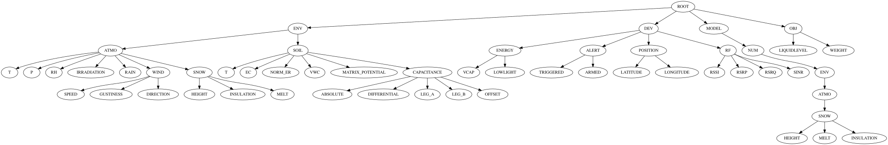

# Measureables

This is the central repository containing all definitions and documentation for
our measureable parameters ([name is subject to change](https://www.stackfield.com/run/val/d0fkcbff/e0khehfca/h0hedcgdfk)).

<a href="https://github.com/AGVOLUTION/measureables/blob/master/docs/parameter-tree.svg?raw=true"></img></a>

An overview over the existing parameters can be found in
[Documentation](./documentation.md)
